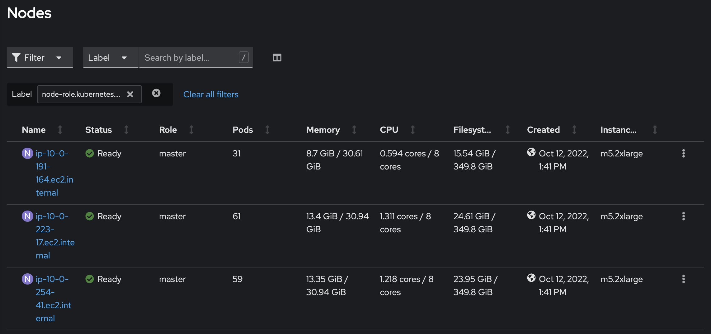
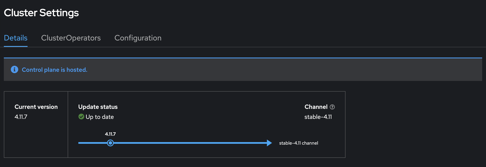
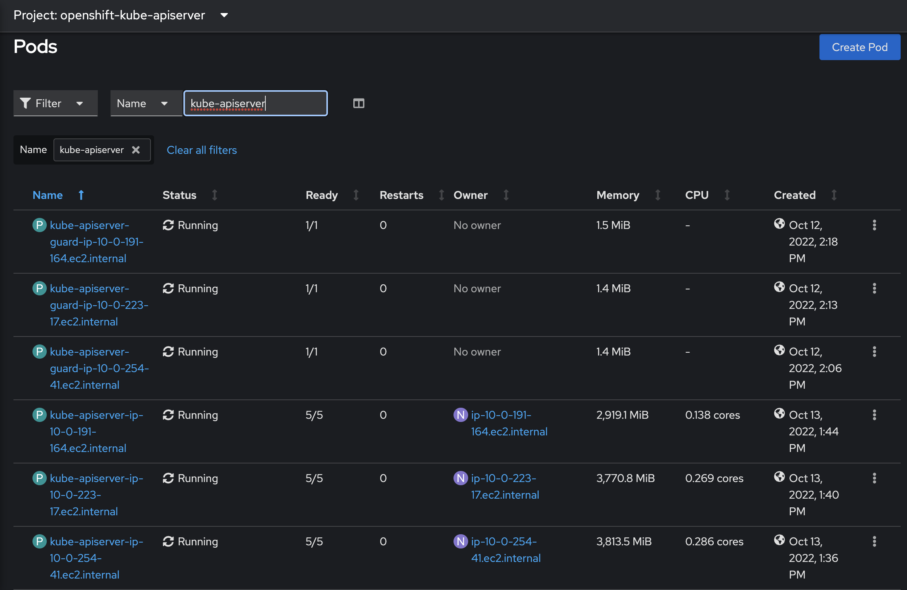
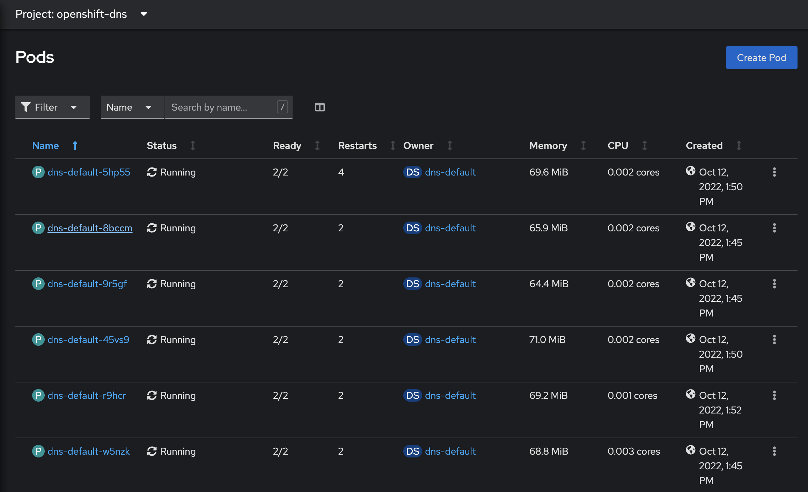
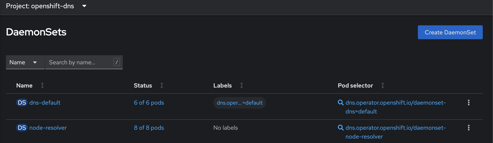

====================================================
Lab 01 - Explore Red Hat Product Demo System cluster
====================================================

.. include:: import-yaml.rst

We will begin with a quick tour of the lab environment. This lab consists of a multi-node kubernetes cluster which has been deployed exclusively for you. This is a sandbox environment. Feel free to play around.

Red Hat Openshift Container Platform configuration review
---------------------------------------------------------

Q1: How many master nodes do you see in the cluster?

Hint:

.. code-block:: text
    
    Compute -> Nodes and filter by label for master

.. dropdown:: Show Solution
    
    Answer: 3

Q2: What is the version of Kubernetes installed in this environment?

1. 1.18
2. 1.20
3. 1.21

Hint:

.. code-block:: text
    
    Admininistration -> Cluster Settings

.. dropdown:: Show Solution
    
    Answer: 1.21 

Q3: What is the status of the `kube-apiserver`?

1. Succeeded
2. CrashloopBackOff
3. Running
4. Attached

Hint:

.. code-block:: text
    
    Workloads -> Pods -> Namespace: openshift-kube-apiserver.  Filter for kube-apiserver.

.. dropdown:: Show Solution
    
    Answer: Running 

Q4: Are there any pods running on the default name space?

1. Yes
2. No

Hint:

.. code-block:: text
    
    Workloads -> Pods -> Namespace: default

.. dropdown:: Show Solution
    
    Answer: No

Q5: What is the name of the dns deployment in the cluster?

1. kube-dns
2. coredns
3. kube-dns

Hint:

.. code-block:: text
    
    Workloads -> Pods -> Namespace: openshift-dns

.. dropdown:: Show Solution
    
    Answer: dns-default

Q6: How many replicas are configured for this deployment?

1. 6
2. 4
3. 1
4. 3

Hint:

.. code-block:: text
    
    Workloads -> Daemonsets -> Namespace: openshift-dns

.. dropdown:: Show Solution
    
    Answer: 6

Portworx configuration review
-----------------------------

Portworx Enterprise is already installed and running on this cluster.  We will investigate the configuration in the next section:

What does Portworx need to be installed?

1. **Drives**: The drive /dev/nvme1n1 is available on each node which we will be using.
2. **Key Value Database (KVDB)**: Such as ETCD. We will be using the Portworx Built-in KVDB instead of deploying our own.
3. **Specification**: Portworx is defined by a spec file, we will create the Portworx cluster using the spec URL.

.. code-block:: text

   Workloads -> Pods -> Filter by Label: name=portworx

Check the installation logs:

.. code-block:: text

    Workloads -> Pods -> 
    Select one of the pods named, portworx-cluster-XXXX
    Go to Logs tab to review the logs

.. image:: images/portworx-logs.png

Lets explore the cluster using pxctl utility.

**Note**: You can run pxctl cli from any of the cluster nodes (node01, node02 or node03) OR you can run it from the portworx pods (label name=portworx)

Portworx on K8's Quiz
---------------------

Q1: How many storage nodes do you see in the PX cluster?

Hint:

.. code-block:: text

    Workloads -> Pods -> 
    Select one of the pods named, portworx-cluster-XXXX
    Go to Terminal tab to review the cluster status. Run: 

    /opt/pwx/bin/pxctl status

.. dropdown:: Show Solution
    
    Answer: 3